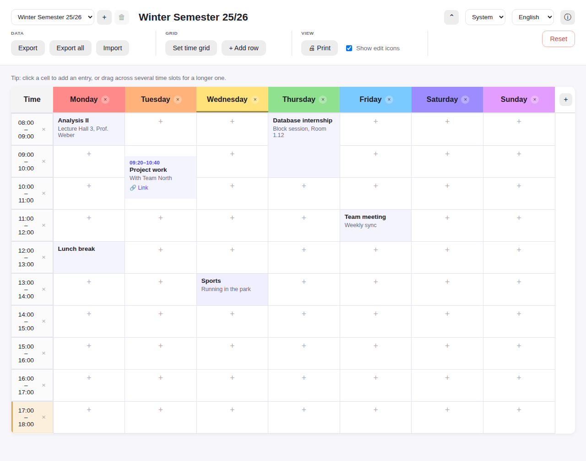
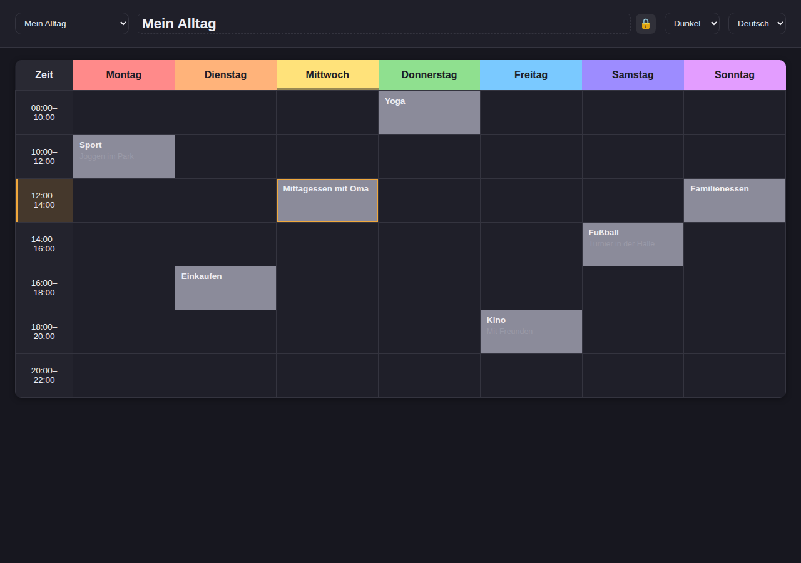
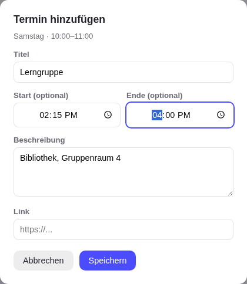
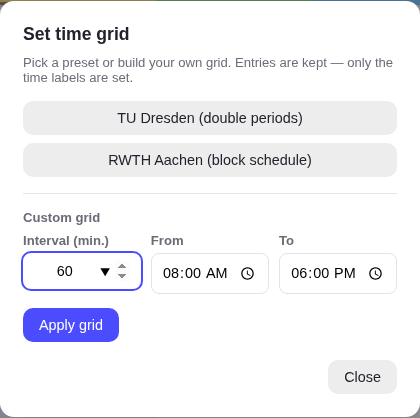

# Vibe-Stundenplan

A single-page app for everyday personal planning: a weekly schedule grid for entries,
tasks, and blocks — right in the browser, no build step, no backend. German and English
are both fully supported.

**Live:** https://fionapreroll.github.io/vibe-stundenplan/



## Features

- Weekly grid with freely renamable, addable, and removable day columns, color-coded in a
  rainbow scheme
- Time grid via preset (TU Dresden, RWTH Aachen) or fully custom — interval in minutes
  (including sub-hour ticks), any start/end time
- Add entries by click or drag-select across several time slots, including an optional
  start/end time independent of the grid (visually inset within the cell)
- Live highlighting of the current time slot and weekday
- Manage and switch between several schedules in parallel
- Export/import as readable JSON — format specified in
  [EXPORT_FORMAT.md](EXPORT_FORMAT.md)
- Switchable German/English, including automatic browser-language detection
- Fully keyboard-operable (Enter saves, Escape discards)
- Light/dark/system theme, plus a one-tap edit lock for a clean, read-only "just look and use
  it" view

Details, architecture, and deliberate scope decisions: see [REQUIREMENTS.md](REQUIREMENTS.md).
Notes for contributing/further development: see [CONTRIBUTING.md](CONTRIBUTING.md).

### Dark mode with editing locked



### Adding an entry



### Setting the time grid



## Running locally

No build needed — just serve it from any local server, e.g.:

```
python3 -m http.server 8000
```

and open `http://localhost:8000`.

## Tests

```
npm test
```

Runs on Node's built-in test runner, no external dependencies needed.

A small `e2e/` Playwright suite additionally guards a couple of layout/CSS behaviors the unit
tests can't see (see [CONTRIBUTING.md](CONTRIBUTING.md)):

```
npm install
npx playwright install --with-deps chromium
npm run test:e2e
```

## Updating screenshots

The screenshots above are automatically regenerated and committed back by GitHub Actions
(`.github/workflows/screenshots.yml`) on every push to `main`. That's the only place in the
project that needs a real devDependency (Playwright, only for this script) — the app itself
stays dependency-free.

Manually:

```
npm install
npx playwright install --with-deps chromium
npm run screenshots
```
